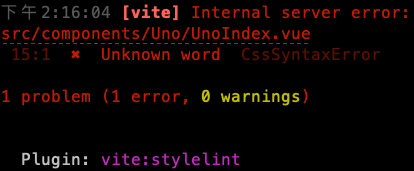

# head first vite(vue)

<details>

This template should help get you started developing with Vue 3 and TypeScript in Vite. The template uses Vue 3 `<script setup>` SFCs, check out the [script setup docs](https://v3.vuejs.org/api/sfc-script-setup.html#sfc-script-setup) to learn more.

## Recommended IDE Setup

* [VS Code](https://code.visualstudio.com/) + [Volar](https://marketplace.visualstudio.com/items?itemName=Vue.volar) (and disable Vetur) + [TypeScript Vue Plugin (Volar)](https://marketplace.visualstudio.com/items?itemName=Vue.vscode-typescript-vue-plugin).

## Type Support For `.vue` Imports in TS

TypeScript cannot handle type information for `.vue` imports by default, so we replace the `tsc` CLI with `vue-tsc` for type checking. In editors, we need [TypeScript Vue Plugin (Volar)](https://marketplace.visualstudio.com/items?itemName=Vue.vscode-typescript-vue-plugin) to make the TypeScript language service aware of `.vue` types.

If the standalone TypeScript plugin doesn't feel fast enough to you, Volar has also implemented a [Take Over Mode](https://github.com/johnsoncodehk/volar/discussions/471#discussioncomment-1361669) that is more performant. You can enable it by the following steps:

1. Disable the built-in TypeScript Extension

   1. Run `Extensions: Show Built-in Extensions` from VSCode's command palette
   2. Find `TypeScript and JavaScript Language Features` , right click and select `Disable (Workspace)`

2. Reload the VSCode window by running `Developer: Reload Window` from the command palette.

</details>

## errors

### 找不到 vue 的宣告檔案

```JS
// src/types/vue-shim.d.ts

declare module "*.vue" {
    import {
        DefineComponent
    } from 'vue'
    const component: DefineComponent < {}, {}, any >
        export default component
}
```

### 找不到模組 'path' 或其對應的型別宣告

```bash
npm install--save-dev @types/node
```

### error TS6504

> error TS6504: File 'src/components/Header/index.vue.js' is a JavaScript file. Did you mean to enable the 'allowJs' option? The file is in the program because: Root file specified for compilation

`<script></script>` 指定 lang="ts" 即可

### .eslintrc.cjs error

> Parsing error: ESLint was configured to run on <tsconfigRootDir>/.eslintrc.cjs using parserOptions.project

### Error [ERR_REQUIRE_ESM]: require() of ES Module

> .stylelintrc.js is treated as an ES module file as it is a .js file whose nearest parent package.json contains "type": "module" which declares all .js files in that package scope as ES modules.

Instead rename .stylelintrc.js to end in .cjs, change the requiring code to use dynamic import() which is available in all CommonJS modules, or change "type": "module" to "type": "commonjs"

将.stylelintrc.js文件的扩展名改为.cjs

```JS
// tsconfig.json
"include": [
    "src/**/*.ts",
    "src/**/*.d.ts",
    "src/**/*.tsx",
    "src/**/*.vue",
    ".eslintrc.cjs",
    "vite.config.ts"
],
```

```JS
// .eslintrc.cjs
parserOptions: {
    project: ['tsconfig.json', 'tsconfig.node.json'],
},
```

### vue3开启eslint之后报错：error Parsing error: ‘＞‘ expected

```JS
{
    // original config
    parser: "vue-eslint-parser",
    parserOptions: {
        parser: "@typescript-eslint/parser",
        // original
    },
}
```

### CssSyntaxError



> [vite] Internal server error:
src/components/Uno/UnoIndex.vue
 15:1  ✖  Unknown word  CssSyntaxError

* 原因：Stylelint是14版本不兼容vue3，Stylelint降级到13版本
* <https://github.com/torchbox/stylelint-config-torchbox/issues/30>

```js
// .stylelintrc.cjs
module.exports = {
    // See https://github.com/torchbox/stylelint-config-torchbox for rules.
    extends: 'stylelint-config-torchbox',
    overrides: [
        {
             // Ensure Vue files aren't treated solely as html or scss
            files: ["*.vue"],
            customSyntax: "postcss-html"
        },
    ],
};
```

and install/add `postcss-html` to our dev-dependencies, the error goes away.

Although the error started appearing after the v14 update, it is still present at `stylelint` v15 and the latest `stylelint-config-torchbox` versions.

## UnoCSS

**注意: Vite 配置文件中如果有 PostCSS 配置的情况下会覆盖掉 post.config.js 的内容!**

<!-- official website hyperlink -->

[UnoCSS](https://unocss.dev/integrations/vite)

```bash
pnpm add -D unocss
```

```bash
pnpm add -D @unocss/postcss
```

```JS
// main.ts
import {
    createApp
} from 'vue'
import App from './App.vue'
import './style.css'

createApp(App).mount('#app')
```

```css
/* style.css */
@unocss all;
```

```JS
// uno.config.ts
import {
    defineConfig,
    presetAttributify,
    presetIcons,
    presetTypography,
    presetUno,
    presetWebFonts,
} from 'unocss'

export default defineConfig({
    presets: [
        presetUno({
            attributifyPseudo: true,
        }),
        presetAttributify(),
        presetIcons({
            scale: 1.2,
        }),
        presetTypography(),
        presetWebFonts({
            provider: 'none',
            fonts: {
                script: 'Homemade Apple',
            },
        }),
    ],
})
```

```JS
// postcss.config.cjs
module.exports = {
    plugins: {
        '@unocss/postcss': {},
    },
}
```

## eslint

parser

```bash
pnpm i -D @typescript-eslint/parser@latest
```
